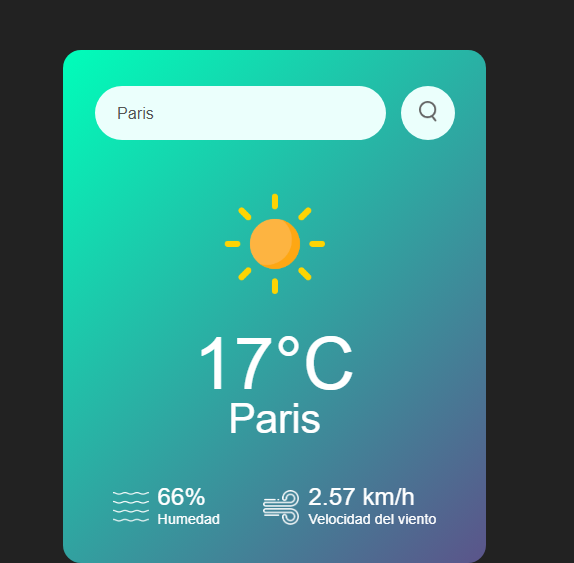

# 🌦️ Weather App

Aplicación web interactiva que consulta y muestra el clima actual de diferentes ciudades en tiempo real utilizando la API de OpenWeatherMap.

---

## Características

* Búsqueda dinámica de clima por nombre de ciudad.
* Visualización de temperatura en grados Celsius (°C).
* Indicadores detallados de porcentaje de humedad y velocidad del viento.
* Cambio dinámico de iconos climáticos según el estado del tiempo (despejado, lluvia, nubes, niebla, llovizna).
* Manejo de errores para entradas vacías y ciudades no encontradas (404).

---

## Tecnologías utilizadas

* **HTML5:** Estructura semántica.
* **CSS3:** Diseño responsivo, fuentes personalizadas y estilos modernos con degradados.
* **JavaScript (Vanilla):** Lógica asíncrona (`async/await`), consumo de APIs con `Fetch` y manipulación del DOM.
* **OpenWeatherMap API:** Fuente de datos meteorológicos.

---

## Instalación y configuración local

1. Cloná este repositorio:
   ```bash
   git clone https://github.com/FlorenciaVS7/clima_javascript.git


<p align="center">
  
</p>  